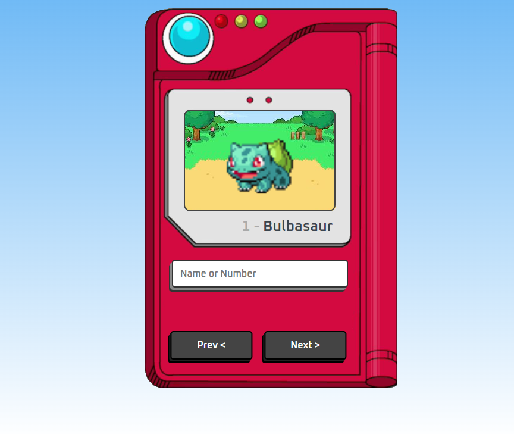

# 🎮 Pokédex GIF Viewer
This project is a modern, **fully responsive** Pokédex built with **HTML, CSS, and JavaScript**, utilizing the **PokéAPI** to **fetch and display animated GIFs** of Pokémon. Users can search for their favorite Pokémon by entering its name or Pokédex number in the input field, and the corresponding animated GIF is displayed, making the experience fun and interactive.

Additionally, the Pokédex features **Next and Previous buttons**, allowing users to easily navigate through the Pokémon list without typing. The responsive design ensures a seamless experience across all devices, from large screens to mobile phones, while maintaining a vibrant and engaging Pokémon-inspired aesthetic.

# 🛠️ Main Features
- **HTML, CSS & JavaScript Integration**
- **PokéAPI Integration for Pokémon Data and Animated GIFs**
- **Search Functionality by Name or Number**
- **"Next" and "Previous" Buttons for Navigation**
- **Fully Responsive Design**
- **Modern and Playful UI/UX Design**

📷 Screenshots

